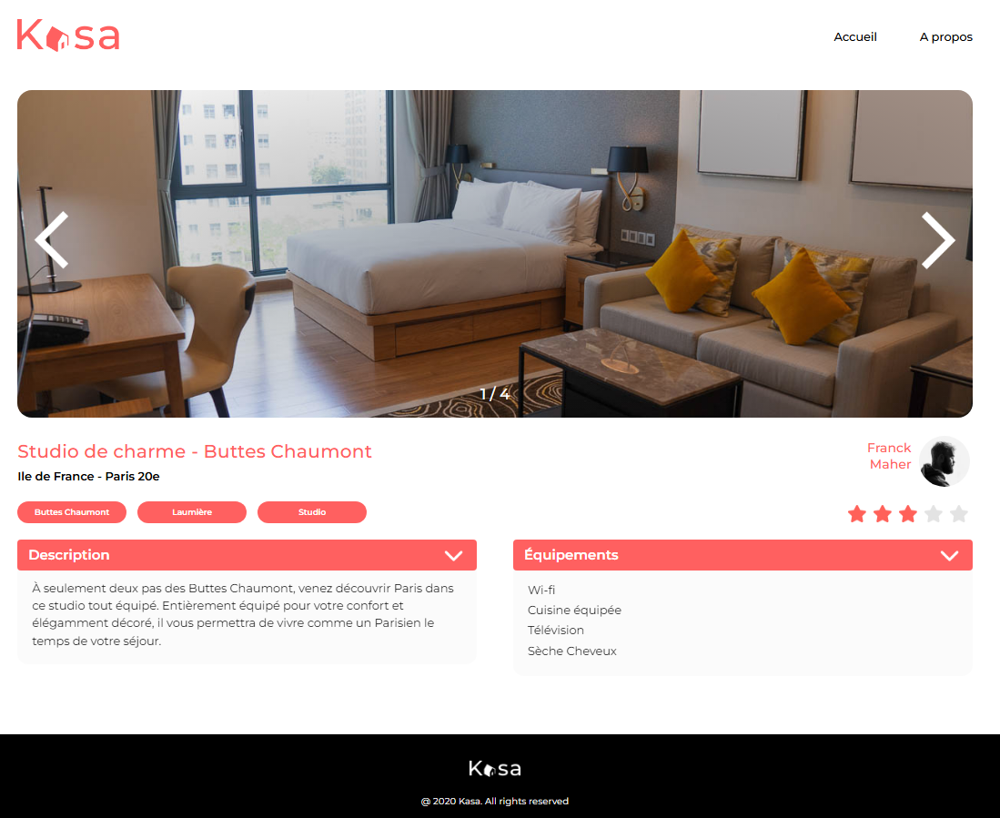

# Projet 11 - Kasa


Onzième projet de la formation OpenClassrooms : Développeur d'applications Javascript/React. <br /> <br />
Objectif : 
- Créer des composants avec React
- Développer les routes d'une application web avec React Router
- Initialiser une application web avec un framework

## Contexte
Développer une nouvelle version front-end du site Kasa, qui propose une sélection de logements locatifs. Le back-end et la base de données n'étant pas encore finalisés, des données mockées ont été utilisées dans ce projet pour projeter le client.

## Installation

Les librairies intégrées au projet sont : <br />
\- SASS <br />
\- Typescript <br />
\- Eslint <br /> <br />
Pour récupérer le projet, clonez directement ce repository puis faites un ``` npm install ```. <br />

## Demo

